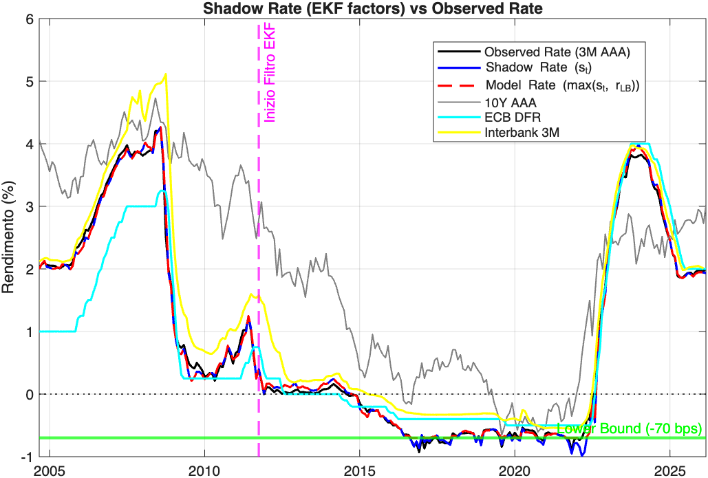
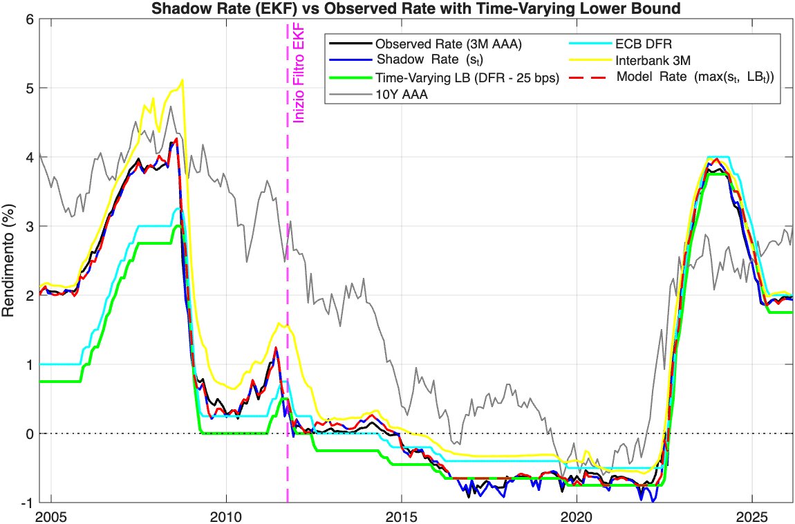
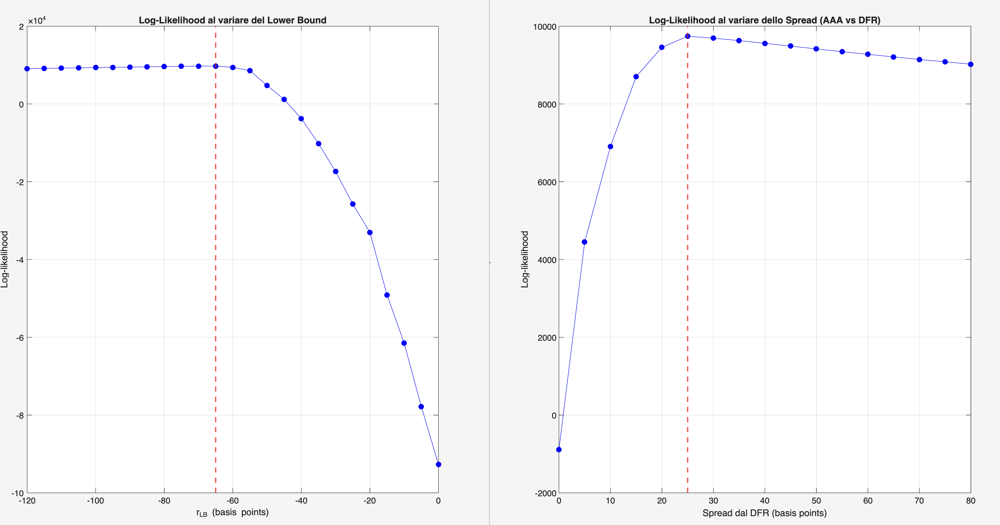

# Euro Area Shadow Rate Term Structure Model (SRTSM)
This repository contains a MATLAB implementation of a Shadow Rate Term Structure Model for the Euro Area. The codebase replicates and extends the framework proposed by Lemke & Vladu (2017) to estimate the latent shadow short rate and analyze monetary policy expectations during the Effective Lower Bound (ELB) period.

## Project Overview
The model extracts the shadow rate by combining a baseline affine term structure model with a non-linear Extended Kalman Filter (EKF). It is designed to handle deep negative interest rates and structural shifts in the yield curve caused by unconventional monetary policies (like QE and forward guidance).

Shadow Rate ONE Lower Bound since 2011             |  Shadow Rate Time Varying Lower Bound since 2011: $DF_t - \delta$
:-------------------------:|:-------------------------:
  |  

### Core Methodology
The architecture is built upon three foundational papers in term structure modeling:
1. **Joslin, Singleton, and Zhu (2011)**: Used for the baseline linear Affine Term Structure Model (ATSM) estimation and risk-neutral ($\mathbb{Q}$) parameter rotation.
2. **Lemke and Vladu (2017)**: The core shadow rate framework estimating a constant/dynamic Effective Lower Bound (ELB) and the associated shadow rate path.
3. **Wu and Xia (2016)**: Implemented their analytical approximation for bond pricing inside the non-linear measurement equation. This replaces computationally heavy Monte Carlo pricing, providing analytical Jacobians for the Extended Kalman Filter and ensuring extreme numerical stability.

## Current Features
- **PCA Factor Extraction**: Demeaning and extraction of Level, Slope, and Curvature factors from the pre-LB period.
- **Maximum Likelihood Estimation (MLE)**: Cross-sectional optimization of JSZ structural parameters.

## Repository Structure

```
SRTSM/
│
├── data/                              # Input data files
│   ├── aaa_yelds_curve.xlsx           # Euro Area AAA Government Yield Curve
│   ├── ecb_df.xlsx                    # ECB Deposit Facility Rate data
│   └── irt3m.xlsx                     # 3-month short-term interest rate data
│
├── resources/                         # Reference papers
│   ├── ecb.wp2600~8dae8e832f.en.pdf   # Lemke & Vladu (2017) — ECB Working Paper
│   ├── JSZ_2011_RFS.pdf               # Joslin, Singleton & Zhu (2011)
│   └── notes_on_paper.pdf             # Personal notes on methodology and paper
│ 
├── results/                           # Output
│   ├── likelihood_comparison.png      # Comparison of log_likelihood functions
│   ├── shadow_rate.png                # Output plot of the estimated Shadow Rate One LB
│   ├── Time_Varying_Shadow_Rate.png   # Output plot of the estimated Shadow Rate TIme Varying LB
│   ├── one_lb_vs_TV_lb.png            # Comparison of the two shadow rate: One lower bound VS Time Varying
│   │
│   ├── Shadowrate_one_lb_sep2004_mar2026.mat   # exported One LB sahdow rate
│   └── Shadowrate_TV_lb_sep2004_mar2026.mat    # exported TV LB sahdow rate
│
├── jsz_obj_function.m                 # Objective function for JSZ MLE estimation
├── latent_run_EKF_shadow.m            # Extended Kalman Filter for shadow rate
├── latent_run_EKF_shadow_TV.m         # Extended Kalman Filter for shadow rate (Time Varying)
├── main.m                             # Main entry point — run this script
├── LICENSE
└── README.md
```

## Data
Currently, the model runs on the **Euro Area AAA Government Yield Curve** (maturities: 3M, 6M, 1Y, 2Y, 3Y, 5Y, 7Y, 10Y). 
* Note: The original model relies on EONIA OIS curves. Since full historical OIS term structures are not freely available via public ECB databases (which only provide the discontinued overnight EONIA rate), this implementation currently uses the closest available proxy data to replicate the risk-free yield curve.

## Work In Progress / Future Steps
This is an active research project. Upcoming implementations include:
- [x] **Grid Search for ELB**: Automated grid search maximizing the log-likelihood of the EKF to estimate the market-perceived lower bound.
- [ ] **Out-of-Sample Forecasting (Zero Look-Ahead Bias)**: A dedicated module to compute the market-implied "Lift-off" timing (e.g., crossing the 25 bps threshold).
- [ ] **OIS/€STR Integration**: Replacing AAA yields with the EONIA/€STR swapped curve to strip out sovereign scarcity premia and exactly replicate Lemke-Vladu's dataset.
- [x] **Time-Varying Lower Bound (WIP)**: Linking the ELB dynamically to the ECB's Deposit Facility Rate (DFR) rather than estimating a single historical floor.

## How to Run
Run the main script `main.m`. The script is modularized into distinct blocks (Data Loading, JSZ Estimation, EKF Filtering*, OOS Forecasting*).

## Appendix:
### 📊 Parameter Calibration & Likelihood Profiling

To ensure the model's empirical robustness, a **grid search optimization** was performed on the key non-linear parameters of the Shadow-Rate Term Structure Model (SRTSM). The charts below illustrate the Log-Likelihood profiles for the two primary specifications used in this study:



#### Calibration Insights:
* **Left Panel (Fixed Lower Bound):** The likelihood profile for a constant $r_{LB}$ shows a global maximum at **-65 to -70 bps**.
* **Right Panel (Time-Varying Spread):** When anchoring the lower bound to the official policy rate ($r_{LB,t} = DFR_t - \Delta$), the likelihood is maximized at an offset $\Delta$ of **25 bps**. 

**Key Takeaway:** The two independent calibration methods yield highly consistent results. During the peak of the ECB's easing cycle (when the Deposit Facility Rate was at -50 bps),both specifications converge to an effective floor of approximately **-70 to -75 bps**. This demonstrates that the model accurately extracts the market-implied physical lower bound of the Eurosystem.

---

### 🛠️ Implementation & Model Robustness

#### Conditional Lower Bound Logic
A critical feature of this implementation is the handling of the normalization phase. The time-varying lower bound is constrained as follows:
$$LB_t = \min(DFR_t - \Delta, 0)$$
